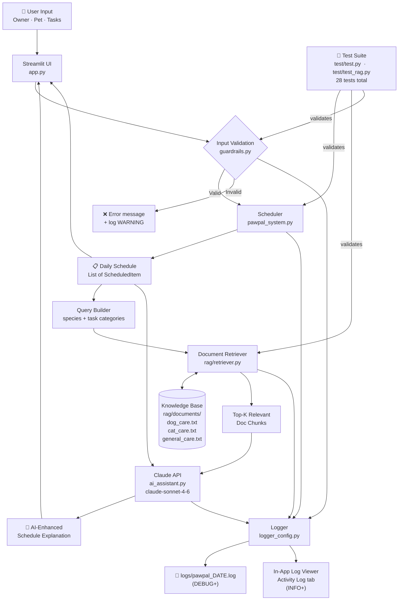

# PawPal+ System Diagram

## Architecture Overview

## Data Flow (step by step)

| Step | Component | What happens |
|------|-----------|--------------|
| 1 | **User Input** | Owner enters name, time budget, pet info, and care tasks in the Streamlit UI |
| 2 | **Validation** | `guardrails.py` checks all inputs (format, numeric bounds, non-empty names) and logs any errors |
| 3 | **Scheduling** | `Scheduler.generate_schedule()` ranks due tasks by priority score and greedily assigns them to time slots |
| 4 | **RAG Retrieval** | `Retriever` searches the knowledge base using pet species + task categories as a keyword query |
| 5 | **Generation** | `AIAssistant` injects retrieved doc chunks into a Claude API prompt and gets a contextualised explanation |
| 6 | **Output** | Streamlit displays the schedule table, conflict summary, and AI explanation |
| 7 | **Logging** | All INFO+ events are shown in the Activity Log tab and written to a daily log file |

## Human Evaluation Points

- **Schedule review** — the owner reads the generated schedule and AI explanation before acting on it.
- **Guardrail feedback** — validation errors surface immediately in the UI before any AI call is made.
- **Activity Log** — the log tab lets a user (or grader) trace every decision the system made.
- **Test suite** — 28 automated tests verify core scheduling behaviours and RAG retrieval correctness; results can be reviewed by any evaluator with `pytest test/ -v`.
